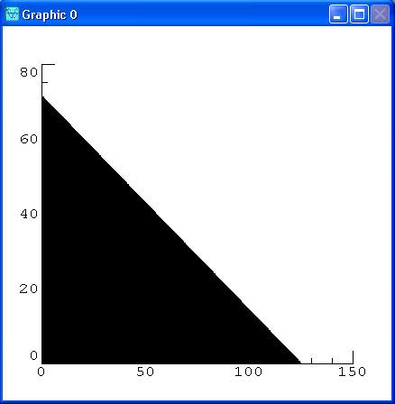
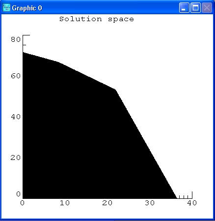
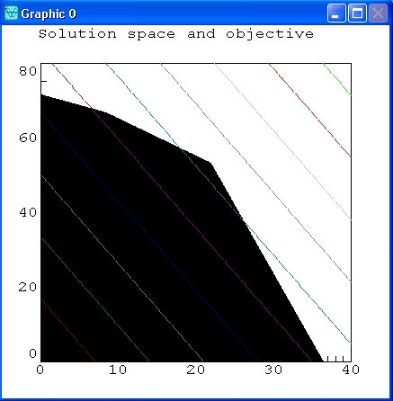

# Formulation of an LP Problem

This is the C# version of the [Formulation of an lp problem in lpsolve](https://lp-solve.github.io/formulate.htm) from the original lpsolve library.

We shall illustrate the method of linear programming by means of a simple example, giving a combination graphical/numerical solution, and then solve the problem in LpSolveDotNet.

## Description

Suppose a farmer has 75 acres on which to plant two crops: wheat and barley.
To produce these crops, it costs the farmer (for seed, fertilizer, etc.) $120 per acre for the wheat and $210 per acre for the barley.
The farmer has $15000 available for expenses.
But after the harvest, the farmer must store the crops while awaiting favourable market conditions.
The farmer has storage space for 4000 bushels.
Each acre yields an average of 110 bushels of wheat or 30 bushels of barley.
If the net profit per bushel of wheat (after all expenses have been subtracted) is $1.30 and for barley is $2.00, **how should the farmer plant the 75 acres to maximize profit?**

## Solutions

## [Mathematical and Graphical Solution](#tab/mathematical)

We begin by formulating the problem mathematically.
First we express the objective, that is the profit, and the constraints algebraically, then we graph them, and lastly we arrive at the solution by graphical inspection and a minor arithmetic calculation.

Let $x$ denote the number of acres allotted to wheat and $y$ the number of acres allotted to barley. Then the expression to be maximized, that is the profit, is clearly

$$
\begin{align*}
P &= 110*1.30*x + 30*2.00*y \\
  &= 143*x + 60*y
\end{align*}
$$

There are three constraint inequalities, specified by the limits on expenses, storage and acreage. They are respectively:

$$
\begin{align*}
120*x + 210*y &\leq 15000 \\
110*x + 30*y &\leq 4000 \\
x + y &\leq 75
\end{align*}
$$

Strictly speaking there are two more constraint inequalities forced by the fact that the farmer cannot plant a negative number of acres, namely:

$$
\begin{align*}
x &\geq 0 \\
y &\geq 0
\end{align*}
$$

Next we graph the regions specified by the constraints. The last two say that we only need to consider the first quadrant in the x-y plane. Here's a graph delineating the triangular region in the first quadrant determined by the first inequality.

Now let's put in the other two constraint inequalities.

The black area is the solution space that holds valid solutions. This means that any point in this area fulfils the constraints.

Now let's superimpose on top of this picture a contour plot of the objective function P.

The lines give a picture of the objective function.
All solutions that intersect with the black area are valid solutions, meaning that this result also fulfils the set constraints.
The more the lines go to the right, the higher the objective value is.
The optimal solution or best objective is a line that is still in the black area, but with an as large as possible value.

It seems apparent that the maximum value of P will occur on the level curve (that is, level line) that passes through the vertex of the polygon that lies near `(22,53)`.
It is the intersection of $$x + y = 75$$ and $$110*x + 30*y = 4000$$
This is a corner point of the diagram.
This is not a coincidence.
The simplex algorithm, which is used by lpsolve, starts from a theorem that the optimal solution is such a corner point.
In fact we can compute the result:

$$
\begin{align}
  \tag{1} x + y &= 75 \\
  \tag{2} 110*x + 30*y &= 4000 
\end{align}
$$

From $(1)$, $y$ can be expressed in function of $x$:

$$
  \tag{3} y = 75 - x
$$

This equation can be substituted in $(2)$:

$$
\begin{align*}
& 10*x + 30*(75 - x) = 4000 \\
\implies & 80*x = 1750 \\
\implies & x = 21.875
\end{align*}
$$

From $(3)$, $y$ can be derived:

$$
\begin{align*}
y &= 75 - 21.875 \\
  &= 53.125
\end{align*}
$$

The acreage that results in the maximum profit is 21.875 for wheat and 53.125 for barley. In that case the profit is:

$$
\begin{align*}
P &= 143*x + 60*y \\
  &= 143*21.875 + 60*53.125 \\
  &= 6326.625
\end{align*}
$$

That is, profit is `$6315.63`.

Now, lpsolve comes into the picture to solve this linear programming problem more generally.

First let us show this problem in its mathematical format:

- Objective:
$$
\begin{align*}
max(143*x + 60*y)
\end{align*}
$$

- Constraints:
$$
\begin{align*}
120*x + 210*y &\leq 15000 \\
110*x + 30*y &\leq 4000 \\
x + y &\leq 75 \\
x &\geq 0 \\
y &\geq 0
\end{align*}
$$

Now see in _LpSolveDotNet Solution_ tab on how to define and solve this model using LpSolveDotNet.

## [LpSolveDotNet Solution](#tab/lpsolvedotnet)

[!code-csharp]
